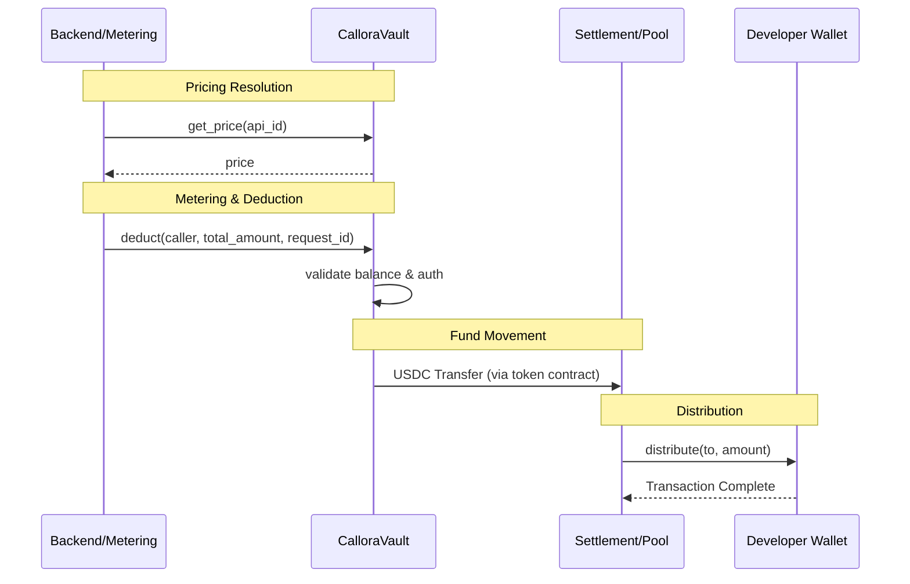

# Callora Contracts

Soroban smart contracts for the Callora API marketplace: prepaid vault (USDC) and balance deduction for pay-per-call settlement.

[](https://github.com/CalloraOrg/Callora-Contracts/actions/workflows/ci.yml)
[](https://github.com/CalloraOrg/Callora-Contracts/actions/workflows/coverage.yml)

## Tech stack

- **Rust** with **Soroban SDK** (Stellar)
- Contract compiles to WebAssembly and deploys to Stellar/Soroban
- Minimal WASM size (~17.5KB for vault)

## What’s included

### 1. `callora-vault`

The primary storage and metering contract.

- `init(owner, usdc_token, ..., authorized_caller, min_deposit, revenue_pool, max_deduct)` — Initialize with owner and optional configuration.
- `deposit(caller, amount)` — Owner or allowed depositor increases ledger balance.
- `deduct(caller, amount, request_id)` — Decrease balance for an API call; routes funds to settlement.
- `batch_deduct(caller, items)` — Atomically process multiple deductions.
- `set_allowed_depositor(caller, depositor)` — Owner-only; delegate deposit rights.
- `set_authorized_caller(caller)` — Owner-only; set the address permitted to trigger deductions.
- `get_price(api_id)` — returns `Option<i128>` with the configured price per call for `api_id`.

## Architecture & Flow

The following diagram illustrates the interaction between the backend, the user's vault, and the settlement contracts during an API call.



- `get_meta()` / `balance()` — View configuration and current ledger balance.
- `set_metadata` / `get_metadata` — Attach off-chain metadata (IPFS/URI) to offerings.

### 2. `callora-revenue-pool`

A simple distribution contract for revenue.

- `init(admin, usdc_token)` — Initialize with an admin and USDC token.
- `distribute(caller, to, amount)` — Admin sends USDC from this contract to a developer.
- `batch_distribute(caller, payments)` — Atomically distribute to multiple developers.
- `receive_payment(caller, amount, from_vault)` — Log payment receipt for indexers.

### 3. `callora-settlement`

Advanced settlement with individual developer balance tracking.

- `init(admin, vault_address)` — Link to the vault and set admin.
- `receive_payment(caller, amount, to_pool, developer)` — Receive funds from vault; credit global pool or specific developer.
- `get_developer_balance(developer)` — Check tracked balance for a specific developer.
- `get_global_pool()` — View total accumulated pool balance.
- `set_vault(caller, new_vault)` — Admin-only; update the linked vault address.

## Local setup

1. **Prerequisites:**
   - [Rust](https://rustup.rs/) (stable)
   - [Stellar Soroban CLI](https://developers.stellar.org/docs/smart-contracts/getting-started/setup) (`cargo install soroban-cli`)

2. **Build and test:**

   ```bash
   cargo build
   cargo test
   ```

3. **Build WASM:**

   ```bash
   # Build all contracts
   cargo build --target wasm32-unknown-unknown --release

   The vault contract WASM binary is optimized to ~17.5KB (17,926 bytes), well under Soroban's 64KB limit. The release profile in `Cargo.toml` uses aggressive size optimizations:
   - `opt-level = "z"` - optimize for size
   - `lto = true` - link-time optimization
   - `strip = "symbols"` - remove debug symbols
   - `codegen-units = 1` - better optimization at cost of compile time

## Development

Use one branch per issue or feature (e.g. `test/minimum-deposit-rejected`, `docs/vault-gas-notes`) to keep PRs small and reduce merge conflicts. Run `cargo fmt`, `cargo clippy --all-targets --all-features -- -D warnings`, and `cargo test` before pushing.

## Test coverage
   # Or use the convenience script
   ./scripts/check-wasm-size.sh
   ```

## Development

Use one branch per issue or feature. Run `cargo fmt`, `cargo clippy --all-targets --all-features -- -D warnings`, and `cargo test` before pushing.

### Test coverage

The project enforces a **minimum of 95% line coverage** on every push via GitHub Actions.

```bash
# Run coverage locally
./scripts/coverage.sh
```

The script will:

1. Check for `cargo-tarpaulin`; install it automatically if it is missing.
2. Run all tests with instrumentation according to `tarpaulin.toml`.
3. Exit with a non-zero code if coverage drops below 95 %.
4. Write reports to the `coverage/` directory (git-ignored).

| Report file                      | Description                                     |
| -------------------------------- | ----------------------------------------------- |
| `coverage/tarpaulin-report.html` | Interactive per-file view — open in any browser |
| `coverage/cobertura.xml`         | Cobertura XML consumed by CI                    |

> **Tip:** You can also run `cargo tarpaulin` directly from the workspace root;
> the settings in `tarpaulin.toml` are picked up automatically.

### CI enforcement

`.github/workflows/coverage.yml` runs on every push and pull-request. It installs tarpaulin, runs coverage, uploads the HTML report as a downloadable artefact, and posts a coverage summary table as a PR comment. A result below 95 % causes the workflow — and the required status check — to fail.

## Project layout

```text
callora-contracts/
├── .github/workflows/
│   └── ci.yml              # CI: fmt, clippy, test, WASM build
├── Cargo.toml              # Workspace and release profile
├── BENCHMARKS.md           # Vault operation gas/cost notes
├── EVENT_SCHEMA.md         # Event names, topics, and payload types
├── UPGRADE.md              # Vault upgrade and migration path
├── scripts/
│   ├── coverage.sh         # One-command local coverage runner
│   └── check-wasm-size.sh  # WASM size verification
├── contracts/
│   ├── vault/
│   │   ├── Cargo.toml
│   │   └── src/
│   │       ├── lib.rs      # Contract logic
│   │       └── test.rs     # Unit tests
│   └── revenue_pool/
│       ├── Cargo.toml
│       └── src/
│           ├── lib.rs      # Settlement contract
│           └── test.rs     # Unit tests
└── README.md
│   ├── ci.yml              # CI: fmt, clippy, test, WASM build
│   └── coverage.yml        # CI: enforces 95% coverage on every push
├── contracts/
│   ├── vault/              # Primary storage and metering
│   ├── revenue_pool/       # Simple revenue distribution
│   └── settlement/         # Advanced balance tracking
├── scripts/
│   ├── coverage.sh         # Local coverage runner
│   └── check-wasm-size.sh  # WASM size verification
├── docs/
│   ├── interfaces/         # JSON contract interface summaries (vault, settlement, revenue_pool)
│   └── ACCESS_CONTROL.md   # Role-based access control overview
├── BENCHMARKS.md           # Gas/cost notes
├── EVENT_SCHEMA.md         # Event topics and payloads
├── UPGRADE.md              # Upgrade and migration path
├── SECURITY.md             # Security checklist
└── tarpaulin.toml          # cargo-tarpaulin configuration
```

## Contract interface summaries

Machine-readable JSON summaries of every public function and parameter for each contract are maintained under [`docs/interfaces/`](docs/interfaces/). They serve as the canonical reference for backend integrators using `@stellar/stellar-sdk`.

| File | Contract |
|------|----------|
| [`docs/interfaces/vault.json`](docs/interfaces/vault.json) | `callora-vault` |
| [`docs/interfaces/settlement.json`](docs/interfaces/settlement.json) | `callora-settlement` |
| [`docs/interfaces/revenue_pool.json`](docs/interfaces/revenue_pool.json) | `callora-revenue-pool` |

See [`docs/interfaces/README.md`](docs/interfaces/README.md) for the schema description and regeneration steps.

## Security Notes

- **Checked arithmetic**: All mutations use `checked_add` / `checked_sub`.
- **Input validation**: Enforced `amount > 0` for all deposits and deductions.
- **Overflow checks**: Enabled in both dev and release profiles.
- **Role-Based Access**: Documented in [docs/ACCESS_CONTROL.md](docs/ACCESS_CONTROL.md).

## Security

See [SECURITY.md](SECURITY.md) for the Vault Security Checklist and audit recommendations.

---

Part of [Callora](https://github.com/CalloraOrg).
