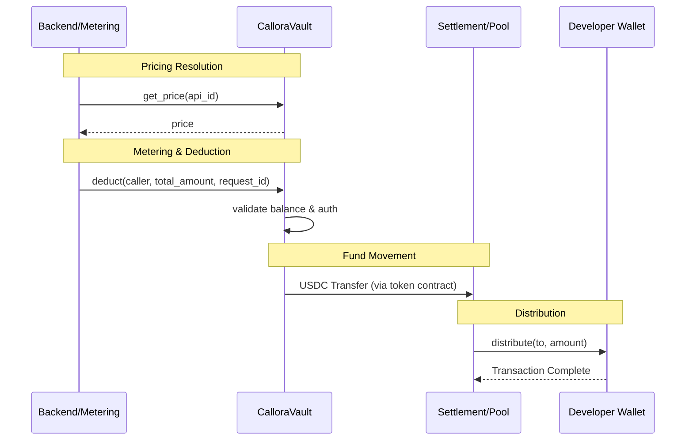

# Callora Contracts

Soroban smart contracts for the Callora API marketplace: prepaid vault (USDC) and balance deduction for pay-per-call settlement.

[](https://github.com/CalloraOrg/Callora-Contracts/actions/workflows/ci.yml)
[](https://github.com/CalloraOrg/Callora-Contracts/actions/workflows/coverage.yml)

## Tech stack

- **Rust** with **Soroban SDK** (Stellar)
- Contract compiles to WebAssembly and deploys to Stellar/Soroban
- Minimal WASM size (~17.5 KB for vault)

## Contract Quickstart

A minimal set of commands to build, test, and produce release WASM for the Soroban contracts in this workspace. Run them from the repository root.

**Prerequisites:** [Rust](https://rustup.rs/) (stable) with the `wasm32-unknown-unknown` target (`rustup target add wasm32-unknown-unknown`).

```bash
# 1. Format & lint (fails on any warning)
cargo fmt --all -- --check
cargo clippy --all-targets --all-features -- -D warnings

# 2. Build and run the full test suite
cargo build
cargo test

# 3. Release WASM for a specific contract
cargo build --target wasm32-unknown-unknown --release -p callora-vault
cargo build --target wasm32-unknown-unknown --release -p callora-revenue-pool
cargo build --target wasm32-unknown-unknown --release -p callora-settlement

# 4. Or build all contracts and verify WASM size limits in one step
./scripts/check-wasm-size.sh

# 5. Line-coverage check (must stay ≥ 95%)
./scripts/coverage.sh
```

Release artifacts land in `target/wasm32-unknown-unknown/release/<crate>.wasm`. The workspace crate names are `callora-vault`, `callora-revenue-pool`, and `callora-settlement` — pass the one you want via `-p`.

## What’s included

### 1. `callora-vault`

The primary storage and metering contract. Holds USDC on behalf of API consumers and deducts balances on every metered call.

The catalogue below omits the Soroban `Env` argument. See the [vault contract interface](docs/interfaces/vault.json) for ABI types, return values, errors, and full signatures.

**Initialization and metering**

- `init(owner, usdc_token, initial_balance, authorized_caller, min_deposit, revenue_pool, max_deduct, settlement)` — Initialize the vault once; the last six configuration values are optional.
- `deposit(caller, amount)` — Owner or allowlisted depositor transfers USDC into the vault.
- `deduct(caller, amount, request_id)` — Authorized caller deducts one metered payment and routes it to settlement.
- `batch_deduct(caller, items)` — Authorized caller atomically processes `(amount, request_id)` items.

**Owner and pending-owner actions**

- `set_authorized_caller(new_caller, nonce)` — Owner-authorized rotation or removal of the deduction caller, protected by a nonce.
- `pause(caller)` / `unpause(caller)` — Owner-only direct circuit-breaker controls; both require the owner as `caller`.
- `withdraw(amount)` / `withdraw_to(to, amount)` — Owner-authorized recovery of tracked USDC; available while paused.
- `set_max_deduct(caller, max_deduct)` — Owner-only update of the per-deduction cap.
- `set_settlement(caller, settlement)` — Owner-only settlement-address update.
- `transfer_ownership(caller, new_owner)` / `accept_ownership()` — Two-step ownership transfer; acceptance is authorized by the pending owner.
- `prune_processed_requests(caller, ids)` — Owner-only removal of processed request markers.
- `add_address(caller, depositor)` / `clear_all(caller)` — Owner-only deposit-allowlist management.
- `set_reserve_cap(caller, token, cap)` — Owner-only reserve-cap update for a token.

**Admin and pending-admin actions**

- `distribute(caller, to, amount)` — Admin-only transfer of untracked USDC surplus; available while paused.
- `set_admin(caller, new_admin)` / `accept_admin()` — Two-step admin transfer; acceptance is authorized by the pending admin.
- `set_timelock_window(caller, window)` — Admin-only configuration of the critical-action timelock window.
- `set_admin_cooldown(caller, seconds)` — Admin-only configuration of the cooldown between critical executions.
- `admin_rescue(caller, token_address, to, amount)` — Admin-only rescue of accidental token transfers; tracked USDC remains protected.

The admin critical actions are timelocked. An admin first calls `propose_*`, waits until the proposal's `execute_after` timestamp, and then calls `execute_*`; `cancel_*` clears a pending proposal. Executing pause, upgrade, or sweep also observes the global admin cooldown.

- `propose_pause(caller)` / `execute_pause(caller)` / `cancel_pause(caller)`
- `propose_upgrade(caller, new_wasm_hash)` / `execute_upgrade(caller)` / `cancel_upgrade(caller)`
- `propose_sweep(caller, to, amount)` / `execute_sweep(caller)` / `cancel_sweep(caller)`

**Read-only views**

- `is_paused()`; `balance()`; `get_owner()`; `get_usdc_token()`; `get_max_deduct()`; `get_settlement()`; `get_revenue_pool()`
- `capabilities()` — Return the supported-feature bitmap.
- `get_timelock_window()`; `get_pending_pause()`; `get_pending_upgrade()`; `get_pending_sweep()`
- `get_admin()`; `get_admin_cooldown()`; `admin_cooldown_remaining()`; `is_admin_action_ready()`; `get_last_critical_admin_action()`
- `is_request_processed(request_id)`; `is_authorized_depositor(caller)`; `get_allowlist()`; `get_reserve_cap(token)`

## Architecture & Flow

The following diagram illustrates the interaction between the backend, the user's vault, and the settlement contracts during an API call.


```mermaid
sequenceDiagram
    participant B as Backend/Metering
    participant V as CalloraVault
    participant S as Settlement/Pool
    participant D as Developer Wallet

    Note over B,V: Pricing Resolution
    B->>V: get_price(api_id)
    V-->>B: price

    Note over B,V: Metering & Deduction
    B->>V: deduct(caller, total_amount, request_id)
    V->>V: validate balance & auth

    Note over V,S: Fund Movement
    V->>S: USDC Transfer (via token contract)

    Note over S,D: Distribution
    S->>D: distribute(to, amount)
    D-->>S: Transaction Complete
```

## Local setup

1. **Prerequisites:**
   - [Rust](https://rustup.rs/) (stable)
   - [Stellar Soroban CLI](https://developers.stellar.org/docs/smart-contracts/getting-started/setup) (`cargo install soroban-cli`)

2. **Build and test:**

   ```bash
   cargo fmt --all
   cargo clippy --all-targets --all-features -- -D warnings
   cargo build
   cargo test --workspace
   ```

3. **Build WASM:**

   ```bash
   # Build all publishable contract crates and verify their release WASM sizes
   ./scripts/check-wasm-size.sh

   # Or build a specific contract manually
   cargo build --target wasm32-unknown-unknown --release -p callora-vault
   ```

## Development

Use one branch per issue or feature. Run `cargo fmt --all`, `cargo clippy --all-targets --all-features -- -D warnings`, `cargo test --workspace`, and `./scripts/check-wasm-size.sh` before pushing so every publishable contract stays within Soroban's WASM size limit.

### Test coverage

The project enforces a **minimum of 95% line coverage** on every push via GitHub Actions (see [`.github/workflows/coverage.yml`](.github/workflows/coverage.yml)).

```bash
# Run coverage locally
./scripts/coverage.sh
```

## Project layout

```
callora-contracts/
├── .github/workflows/
│   ├── ci.yml              # CI: workspace fmt gate, clippy, test, WASM build
│   └── coverage.yml        # CI: enforces 95% coverage on every push
├── contracts/
│   ├── vault/              # Primary storage and metering
│   ├── revenue_pool/       # Simple revenue distribution
│   └── settlement/         # Advanced balance tracking
├── scripts/
│   ├── coverage.sh         # Local coverage runner
│   └── check-wasm-size.sh  # WASM size verification
├── docs/
│   ├── interfaces/                        # JSON contract interface summaries
│   ├── ACCESS_CONTROL.md                  # Role-based access control overview
│   └── CONTRACT_ADDRESS_CONFIGURATION.md  # Operator guide: configure contract addresses
├── BENCHMARKS.md           # Gas/cost notes
├── EVENT_SCHEMA.md         # Event topics and payloads
├── UPGRADE.md              # Upgrade and migration path
├── SECURITY.md             # Security checklist
└── tarpaulin.toml          # cargo-tarpaulin configuration
```

## Contract interface summaries

Machine-readable JSON summaries of every public function and parameter for each contract are maintained under [`docs/interfaces/`](docs/interfaces/). They serve as the canonical reference for backend integrators using `@stellar/stellar-sdk`.

| File | Contract |
|------|----------|
| [`docs/interfaces/vault.json`](docs/interfaces/vault.json) | `callora-vault` |
| [`docs/interfaces/settlement.json`](docs/interfaces/settlement.json) | `callora-settlement` |
| [`docs/interfaces/revenue_pool.json`](docs/interfaces/revenue_pool.json) | `callora-revenue-pool` |

See [`docs/interfaces/README.md`](docs/interfaces/README.md) for the schema description and regeneration steps.

## Operator Guide

Backend operators setting up a new deployment should follow the step-by-step checklist in
[`docs/CONTRACT_ADDRESS_CONFIGURATION.md`](docs/CONTRACT_ADDRESS_CONFIGURATION.md).
It covers deploying and linking the USDC token, settlement contract, and revenue pool,
plus how to verify them with the vault's individual address view functions.

## Security Notes

- **Checked arithmetic**: All balance mutations use `checked_add` / `checked_sub` with explicit panics.
- **Input validation**: `amount > 0` enforced on all deposits and deductions.
- **Overflow checks**: Enabled in both dev and release profiles (`Cargo.toml`).
- **Role-Based Access**: Documented in [docs/ACCESS_CONTROL.md](docs/ACCESS_CONTROL.md).
- **Revenue pool admin audit trail**: `callora-revenue-pool::set_admin` now emits `admin_changed` with `(old_admin, new_admin)` before transfer nomination.
- **Dedup hardening**: Duplicate `get_max_deduct` declaration removed in `callora-vault`; allowed depositor duplicate-path test now asserts list cardinality.
- **Emergency drain (Multisig + timelock)**: `callora-revenue-pool` now exposes `propose_emergency_drain`, `execute_emergency_drain`, `cancel_emergency_drain`, and `get_pending_emergency_drain`. A proposal stores a `PendingEmergencyDrain` snapshot; execution is gated behind a 24-hour timelock (`EMERGENCY_DRAIN_TIMELOCK_SECONDS = 86 400`). When the admin is a Stellar multisig account, `require_auth` enforces the native multi-signature threshold automatically.

See [SECURITY.md](SECURITY.md) for the full Vault Security Checklist and audit recommendations.

---

Part of [Callora](https://github.com/CalloraOrg).
